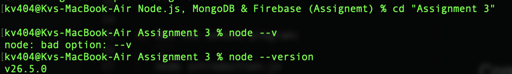
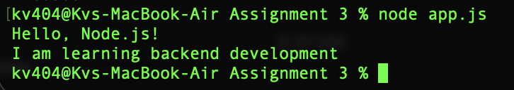
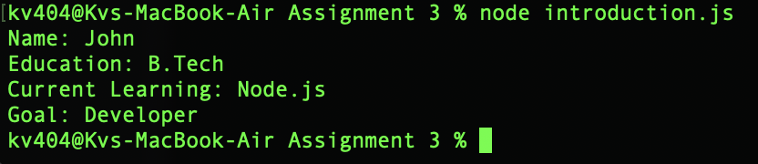

# Assignment 3 - Your First Node.js Program & Introduction Program

## Description
This assignment contains two basic Node.js programs:
1. **app.js** - Prints "Hello, Node.js!" and "I am learning backend development" to the terminal.
2. **introduction.js** - Displays personal introduction details (Name, Education, Current Learning, Goal).

## Steps to Run

1. Make sure Node.js is installed. Check by running:
   ```
   node --version
   ```

2. Open your terminal and navigate to the Assignment 3 folder:
   ```
   cd "Assignment 3"
   ```

3. Run the first program:
   ```
   node app.js
   ```

4. Run the second program:
   ```
   node introduction.js
   ```

## Commands Used
- `node app.js` - Runs the first Node.js program
- `node introduction.js` - Runs the introduction program

## Output Screenshots

### Node.js Version & Navigating to Assignment 3:


### app.js Output:


### introduction.js Output:

